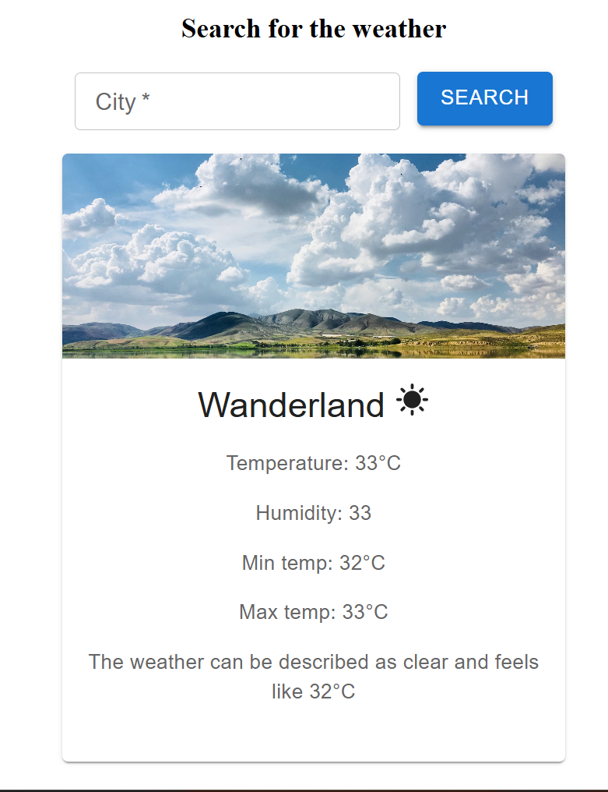

# Weather-app
A modern Weather Application built using React that allows users to search for any city and view real-time weather information. The application fetches weather data from the OpenWeatherMap API and dynamically updates the UI based on the current weather conditions.

# Features
1. Search weather by city name
2. Displays temperature and weather condition
3. Shows humidity information 
4. Dynamic weather images (Rain,snow,clear,cloud)
5. Real time API data fetching

# Technologies Used

1. React
2. JavaScript(ES6)
3. CSS
4. Weather API from OpenWeatherMap

# Screenshot
